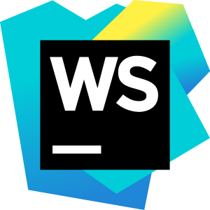
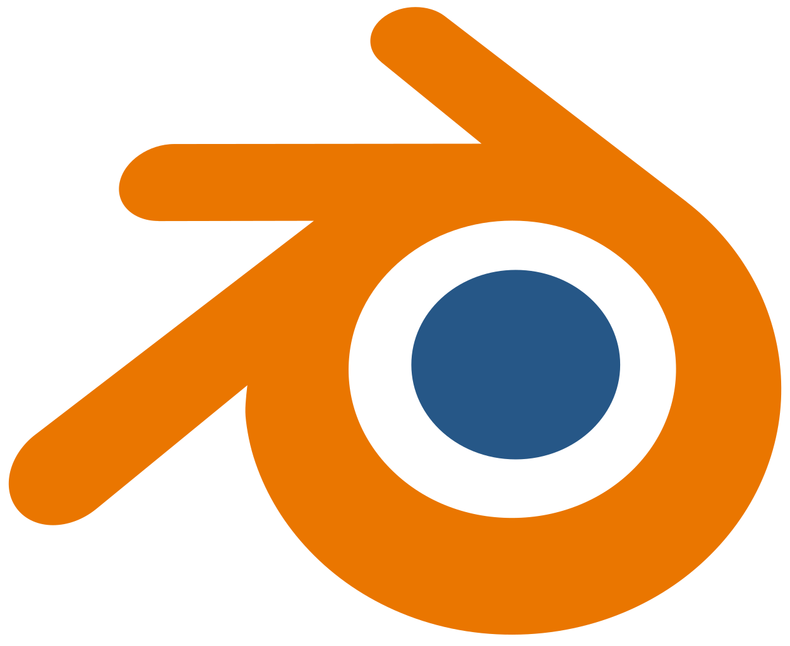
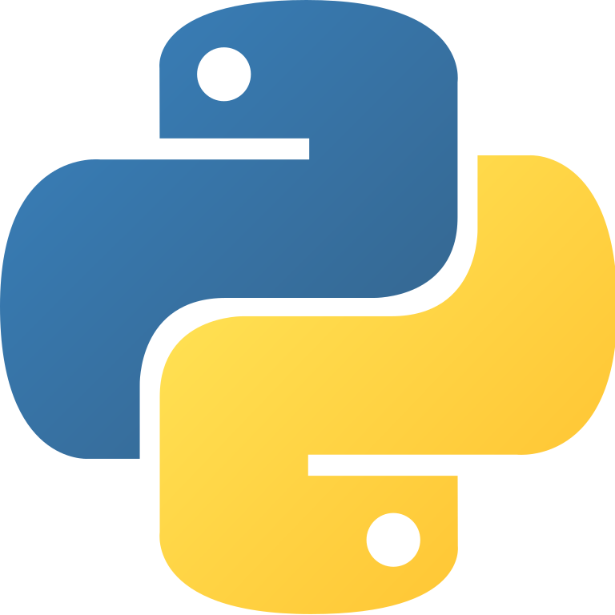
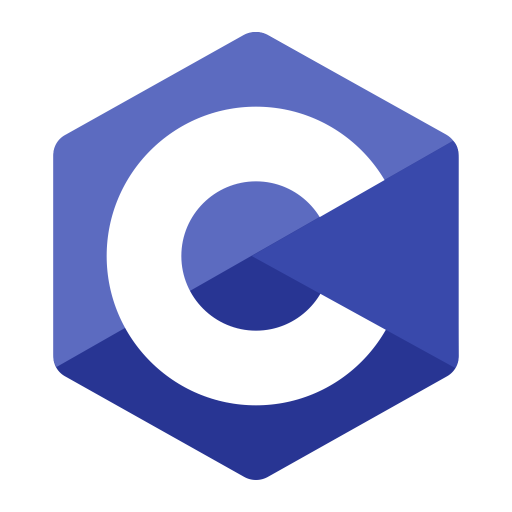
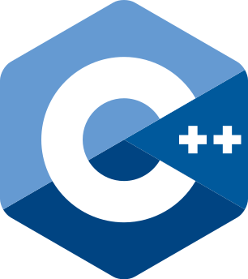

### Hi there 👋 I'm Abhilash Tu
- 🌱 I’m currently learning improving my dynamic programming skills.
- 👯 I’m looking to collaborate on open source.
- 🤔 I’m looking for a study buddy.
- 💬 Ask me about my works or about me.
- 😄 Pronouns: He/Him 🚹
- ⚡ Fun fact: I'm Hyperactive, Curious, Sensitive.
- 🤨 Not so fun fact: Introvert, Overthinking.
<!-- status codes -->
<a align="center" href="https://abhilashtuofficial.github.io">
    

    &nbsp;
                
    

</a>

 

## Connect with me:  

  
 

## Languages and Tools:

[][vscode]
[][vscode]
[][android]
[][java]
[][python]
[][web]
[][behance]
[][behance]
[][behance]
[][github]
[][github]
  
[][web]
[][web]
[][js]
[][python]
[][dart]
[][c/c++]
[][c/c++]
[][flutter]
[][java]
[][shell]
 

[website]: https://abhilashtuofficial.github.io/
[youtube]: https://www.youtube.com/channel/UC8iP2LKB-V1g2jMTbe6Pb4Q
[instagram]: https://www.instagram.com/abhilash_tu/
[linkdein]: https://www.linkedin.com/in/abhilash-tu-160630190/
[vscode]: https://code.visualstudio.com/
[github]: https://github.com/AbhilashTUofficial
[web]: https://github.com/AbhilashTUofficial/Web-development
[js]: https://github.com/AbhilashTUofficial/JavaScript-programming
[python]: https://github.com/AbhilashTUofficial/Python-programming
[dart]: https://github.com/AbhilashTUofficial/CloneApps
[c/c++]: https://github.com/AbhilashTUofficial/Cpp-programming
[flutter]: https://github.com/AbhilashTUofficial/CloneApps
[java]: https://github.com/AbhilashTUofficial/java-programming
[android]: https://github.com/AbhilashTUofficial/CloneApps
[behance]: https://www.behance.net/abhilashstorm
[shell]: https://github.com/AbhilashTUofficial/Shell-scripting
  

